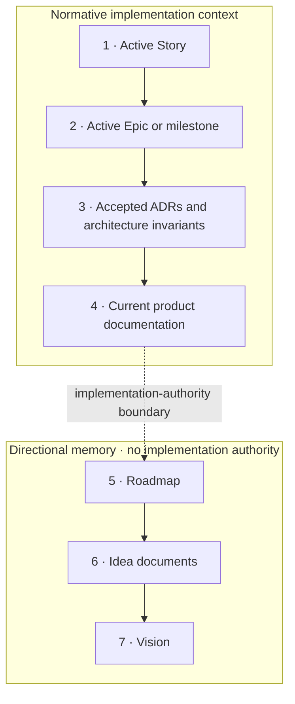

# ADR 001: Delivery authority and information hierarchy

- **Status:** Accepted
- **Date:** 2026-09-10
- **Decision owners:** Pi-Fabric maintainers

## Context

Pi-Fabric benefits from retaining rich future thinking. However, expressing every plausible direction as a GitHub Epic with scope, success criteria, dependencies, and Stories turns memory into apparent implementation authority. Agents then prepare abstractions for several possible futures while delivering today's narrow change.

The repository needs large memory and tiny authority: it may remember many branches, while an executing contributor or agent treats only a small active subset as requirements.

## Decision

Repository information has this authority order:

1. Active Story
2. Active Epic or milestone contract
3. Accepted ADRs and architecture invariants
4. Current product documentation
5. Roadmap
6. Idea documents
7. Vision

Only levels 1–4 are normative implementation context.



Roadmap, vision, and Idea documents describe direction and intent. They MUST NOT be interpreted as requirements, acceptance criteria, delivery commitments, dependencies, or authorization to implement functionality.

Contributors and agents MUST NOT implement, prepare for, generalize toward, or create abstractions for future ideas unless required by active delivery scope.

## Storage classes

| Artifact | Meaning | Expected detail |
| --- | --- | --- |
| Current architecture and feature docs | What the system is and how it behaves now | Precise and normative for current behavior |
| `docs/product/vision.md` | What Pi-Fabric should continue to be | Stable and principled, but not delivery authority |
| `docs/ideas/` | What may be valuable in the future | Rich memory, explicitly non-normative |
| `docs/product/roadmap.md` | What is likely relevant next | Deliberately coarse and directional |
| GitHub milestones, Epics, and Stories | Work actively selected for delivery | Precise, bounded, testable, and executable |
| `docs/decisions/` | Accepted architectural decisions and invariants | Normative within the stated scope |

## Promotion lifecycle

```text
Idea memory
  → directional roadmap placement
  → feasibility evidence or architecture decision
  → active milestone / Epic
  → implementation-ready Stories
  → current product documentation
```

Promotion is deliberate, not automatic. A future direction may remain detailed in an Idea document indefinitely. When an Epic is closed or superseded, its durable intent can return to an Idea document while GitHub preserves the historical record.

## Consequences

### Positive

- Future ideas are retained without silently expanding active scope.
- Agents receive a small authoritative context for each implementation.
- Architecture is driven by current evidence rather than speculative compatibility.
- GitHub Issues represent plausible near-term work.
- Accepted decisions and current behavior remain precise.

### Costs

- Ideas must be promoted before implementation begins.
- Some detail moves between storage classes as its authority changes.
- Roadmap ordering remains intentionally incomplete.
- Maintainers must keep active Issue scope and current docs aligned.

## Enforcement

`AGENTS.md` points contributors and agents to this hierarchy. Every Idea document carries an explicit non-normative header. The roadmap names active work but delegates executable detail to GitHub. Pull requests should reject abstractions justified only by roadmap or Idea content.

## Alternatives considered

### Keep all future directions as detailed open Epics

Rejected because GitHub's executable structure makes uncertain future work appear committed and encourages speculative design.

### Delete future detail until needed

Rejected because it discards product reasoning and repeatedly forces rediscovery.

### Treat all documentation as equally advisory

Rejected because current architecture, accepted decisions, and active delivery contracts must remain dependable implementation inputs.
