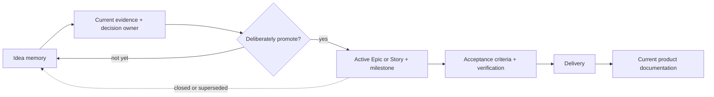

# Idea documents

Idea documents preserve detailed future thinking without turning it into implementation authority.

> **Non-normative:** Nothing under `docs/ideas/` is a requirement, acceptance criterion, delivery commitment, dependency contract, or authorization to implement. An active Story or Epic must explicitly promote the needed scope.

## What belongs here

Ideas may retain:

- essence and intent,
- motivation and possible value,
- constraints and principles,
- details we do not want to forget,
- open questions and risks,
- hypotheses and competing directions,
- evidence that would be needed before promotion.

They should not prescribe:

- acceptance criteria,
- implementation steps,
- committed dependencies,
- story decomposition,
- files to modify,
- or sequencing beyond a clearly labelled hypothesis.

## Promotion

An idea becomes delivery scope only when:

1. current evidence makes it plausible work,
2. unresolved architecture decisions have an owner,
3. the scope is deliberately promoted into an active Epic or Story,
4. acceptance criteria and verification are defined there,
5. and the relevant milestone grants implementation authority.

Closing or superseding an Epic does not erase its thinking; the durable intent returns here while GitHub preserves the historical discussion.

## Current ideas

- [`program-composition.md`](program-composition.md)
- [`program-runner.md`](program-runner.md)
- [`program-invocation.md`](program-invocation.md)
- [`pi-skills-in-programs.md`](pi-skills-in-programs.md)
- [`prompt-resources.md`](prompt-resources.md)
- [`program-ui.md`](program-ui.md)
- [`program-authoring.md`](program-authoring.md)
- [`programmable-pi-conformance.md`](programmable-pi-conformance.md)
