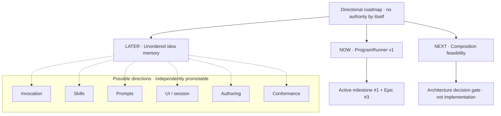

# Product roadmap

**Status:** Directional map / non-normative  
**Implementation authority:** None by itself

This roadmap records likely direction, not delivery commitments. It intentionally avoids acceptance criteria, story decomposition, implementation steps, and dependency contracts. Active GitHub milestones, Epics, and Stories define work that is actually authorized.

## NOW

### ProgramRunner v1 — governed execution parity

Establish an internal runner boundary for reusable Programs while preserving Programs v1 and the existing Fabric execution engine, policy, lifecycle, and flat `fabric_exec` surface.

- Active milestone: [ProgramRunner v1 — governed execution parity](https://github.com/eysenfalk/pi-fabric/milestone/1)
- Active Epic: [#3](https://github.com/eysenfalk/pi-fabric/issues/3)
- Decision basis: [#17](https://github.com/eysenfalk/pi-fabric/issues/17)

## NEXT

### Program composition feasibility

After the current milestone, determine whether bounded shared-root Program composition is architecturally viable without creating a second lifecycle or weakening Fabric governance.

This is a decision gate, not a commitment to implement composition.

- Directional memory: [`../ideas/program-composition.md`](../ideas/program-composition.md)

## LATER

Potential directions, intentionally unordered:

- Program invocation surfaces → [`../ideas/program-invocation.md`](../ideas/program-invocation.md)
- Pi Skills in Programs → [`../ideas/pi-skills-in-programs.md`](../ideas/pi-skills-in-programs.md)
- Prompt resources → [`../ideas/prompt-resources.md`](../ideas/prompt-resources.md)
- Main-session and UI integration → [`../ideas/program-ui.md`](../ideas/program-ui.md)
- Safe Program authoring → [`../ideas/program-authoring.md`](../ideas/program-authoring.md)
- Cross-surface conformance evidence → [`../ideas/programmable-pi-conformance.md`](../ideas/programmable-pi-conformance.md)

Ordering, scope, and eventual delivery remain open until a direction is promoted into an active milestone or Epic.
