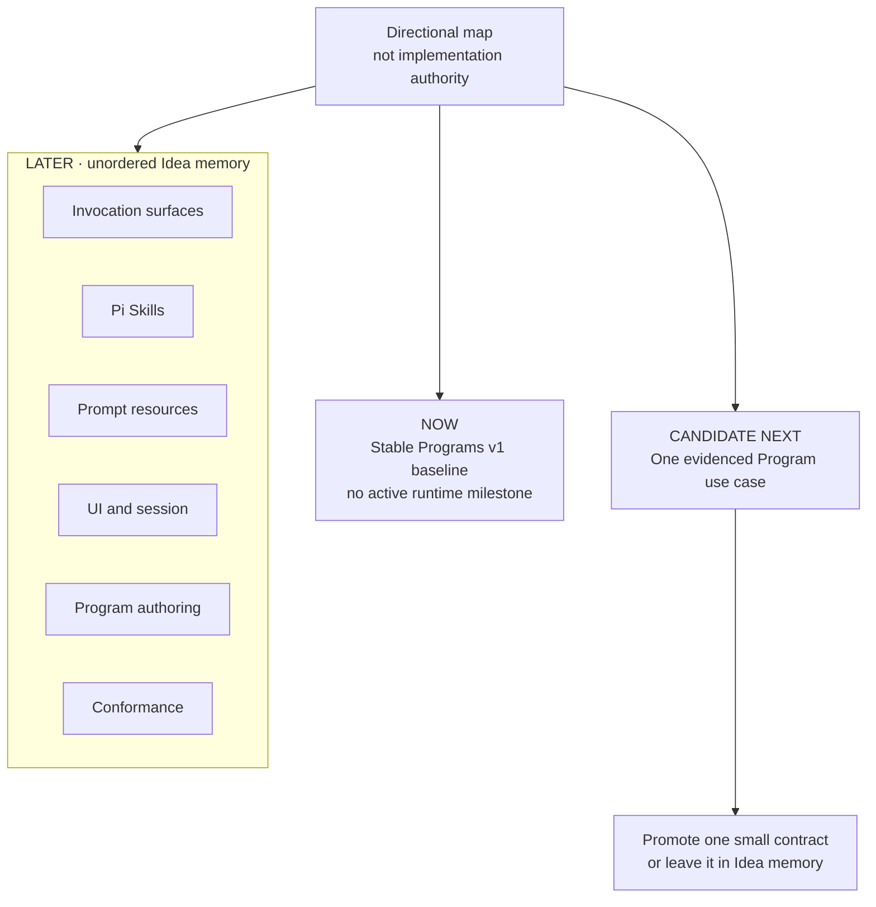

# Roadmap

**Status:** Directional map
**Implementation authority:** None by itself

This roadmap indicates likely attention, not delivery commitments. Only an active Story, its active Epic or milestone contract, accepted architecture decisions, and current product documentation may authorize implementation.

## NOW — Stable Programs v1 baseline

Programmatic Skill binding and reusable Programs v1 are merged product behavior. There is no active runtime Epic or milestone.

The current boundary stays intentionally small: a named Program resolves to source and executes once through the existing Fabric execution service. Documentation and ordinary maintenance may continue, but this roadmap does not authorize another runtime layer.

## CANDIDATE NEXT — Evidence one Program use case

The most plausible next investigation is one concrete, user-facing composition case. The decision question is whether that outcome can preserve Fabric governance through the current execution foundation with a smaller seam than a new runner abstraction.

See:

- [`../ideas/program-composition.md`](../ideas/program-composition.md)
- [`../ideas/program-runner.md`](../ideas/program-runner.md)

Promotion requires a separately approved active issue with an observable user outcome. Either idea may remain uncommitted if the evidence does not justify implementation.

## LATER — Unordered directions

These directions have no committed order:

- Program invocation surfaces → [`../ideas/program-invocation.md`](../ideas/program-invocation.md)
- Pi Skills as Program resources → [`../ideas/pi-skills-in-programs.md`](../ideas/pi-skills-in-programs.md)
- Prompt resources → [`../ideas/prompt-resources.md`](../ideas/prompt-resources.md)
- Program UI and session integration → [`../ideas/program-ui.md`](../ideas/program-ui.md)
- Safe Program authoring → [`../ideas/program-authoring.md`](../ideas/program-authoring.md)
- Programmable-Pi conformance → [`../ideas/programmable-pi-conformance.md`](../ideas/programmable-pi-conformance.md)

`LATER` is unordered. Its entries may be split, replaced, or never promoted.
