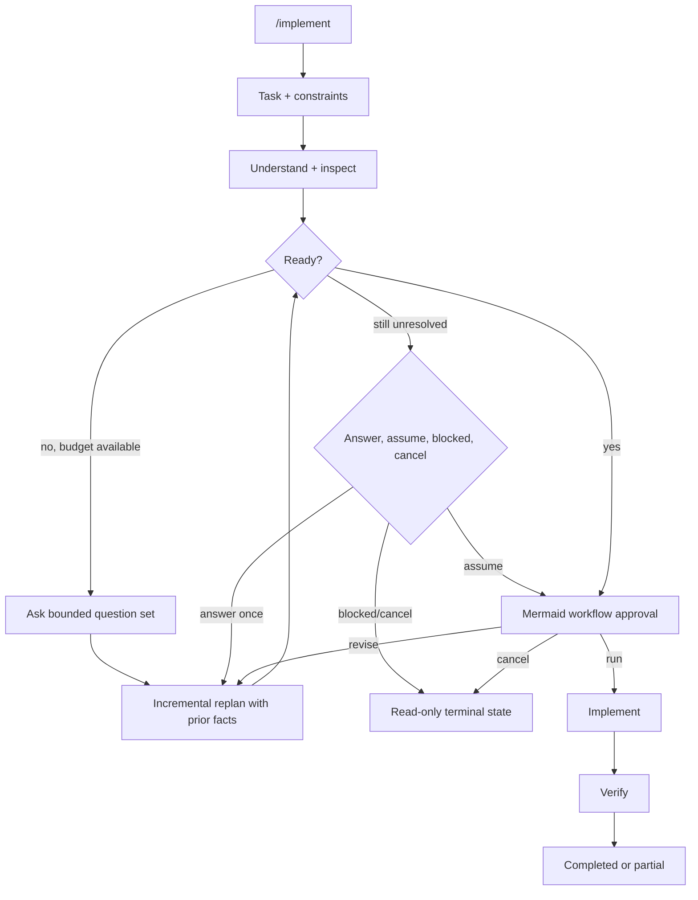

# Reusable Fabric programs

Reusable programs preserve proven orchestration as named code while keeping Fabric's existing runtime as the only execution engine. A named program is resolved to one source body, validated, pinned by digest for that invocation, and passed to the same `FabricExecutionService` used by inline `fabric_exec` code.

## Program locations

Programs are explicitly scope-qualified:

| Scope | Manifest root | Invocation name |
| --- | --- | --- |
| Built-in | Pi-Fabric package `programs/` | `builtin/<name>` |
| Global | `~/.pi/agent/fabric/programs/` | `global/<name>` |
| Project | `.pi/fabric/programs/` | `project/<name>` |

Built-in programs are immutable package resources and remain available in managed hosts. Project programs load only after Pi trusts the project; other local programs are unavailable in managed hosts. Explicit scopes prevent package, global, and project resources from silently shadowing one another.

A program consists of a JSON manifest and a source file. For `project/review`, create:

```text
.pi/fabric/programs/
├── review.json
└── review.ts
```

`review.json`:

```json
{
  "version": 1,
  "description": "Run the standard implementation review",
  "kernel": "typescript",
  "source": "review.ts",
  "parameters": {
    "request": {
      "type": "string",
      "description": "The change to review",
      "required": true
    },
    "preset": {
      "type": "string",
      "default": "standard"
    }
  }
}
```

`review.ts` is an ordinary TypeScript Fabric function body:

```ts
const findings = await agent(
  `Review this request with the ${π.preset} preset:\n\n${π.request}`,
  { label: "review" },
);
return findings;
```

For the Python kernel, set `"kernel": "python"` and use a `.py` source containing an ordinary Python Fabric function body. A program's declared kernel must match the current configured kernel; Fabric never switches kernels or falls back for one invocation.

## Invocation

Pass exactly one source to `fabric_exec`: inline `code` or a named `program`.

```json
{
  "program": "project/review",
  "payloads": {
    "request": "Add GitHub OAuth"
  },
  "display": {
    "name": "Review OAuth implementation"
  }
}
```

Manifest defaults are applied before execution. Missing required payloads and unknown payload names fail before the body runs. Parameters are deliberately string-valued in version 1, matching Fabric's existing `payloads`/`π` transport and keeping the model-facing tool schema flat.

Run `/fabric programs` to list available programs and their parameter contracts. Add a search term to filter the list, for example `/fabric programs review`.

## Built-in `/implement` prototype

`/implement` is the first dedicated product adapter for a packaged Program. In Pi TUI mode it asks for a required task and optional constraints as plain text, projects only the six most recent user/assistant prose messages (never tool output or hidden/custom state), and invokes `builtin/implement` through the same `fabric_exec.execute` path as a model-issued Program call.

Before repository mutation, a read-only planner may ask up to three related material questions per round. Replans retain the previous structured plan, sourced repository facts, and accumulated answers. They do not restart repository discovery. At most one automatic clarification round runs before the user sees an explicit decision gate, subject to a four-call global planner limit and protected token reserves for implementation and evidence.



Material ambiguity is a normal workflow state, not an exception. Human interaction pauses the executor's active-time deadline for as long as the dialog remains open; answering resumes the same remaining budget, while Escape or session shutdown still cancels. The user can spend one final bounded clarification, explicitly proceed with the displayed assumptions, stop with a `blocked` result, or cancel. Proceeding with assumptions still requires the normal visual workflow approval. Expected agent failures before mutation return `blocked`; failures after mutation may have begun return `partial`. Neither path is reported as a raw Program runtime error.

The approval artifact contains a Mermaid workflow, text process structure, intent, non-goals, assumptions and risks, retained repository facts, per-stage explanations, exact Skill bindings, checks, and authority limits. Pi-Fabric transforms the Mermaid fence into Unicode terminal art in the live TUI while preserving real Mermaid Markdown in the stored message. The user can run, revise once, or cancel.

The human-readable resources are deliberately separate:

- [`programs/implement.json`](../programs/implement.json) declares the string input contract.
- [`programs/implement.ts`](../programs/implement.ts) owns stage order, gates, budgets, and reporting.
- `programs/skills/fabric-implement-{plan,change,verify}/SKILL.md` supplies only stage-local engineering discipline. Fabric exposes these immutable private resources to exact agent binding without adding them to Pi's globally model-invokable Skill catalog.
- `interactions.request(...)` is the bounded first-class guest API for host text input and Markdown-backed choices.

Automatic mode is the only mode in this prototype. It does not add a generic per-Program command system, manual stage editor, recursive Program composition, automatic delivery actions, or a second execution service.

## Security and lifecycle

Program manifests and sources are read as data, never imported into the host. Fabric rejects malformed manifests, unknown fields, oversized files, wrong source extensions, traversal, and symlink escapes. The resolved source bytes receive a SHA-256 digest that is persisted with the tool result, so history identifies the exact body even if the file later changes.

After resolution, execution is identical to inline code. Programs receive no additional authority: the configured sandbox, committed capability view, provider registry, approvals, Schema mode, cancellation, deadlines, output limits, and agent/token budgets remain in force.

## Version 1 boundary

Version 1 supports top-level named invocation, normal control flow inside a program, string parameter contracts, defaults, built-in/global/project scopes, and discovery through `/fabric programs`. The dedicated `/implement` command is a bounded adapter for one built-in Program, not generic command registration.

Version 1 intentionally does **not** add generic per-program slash commands or a guest `programs.run()` API. A possible composition capability is retained as a non-normative [Idea document](ideas/program-composition.md). If that direction is promoted later, it must preserve the outer execution frame, capability view, budgets, trace, and handoff boundary. Independent recursive `FabricExecutionService.execute()` lifecycles would violate that boundary.
